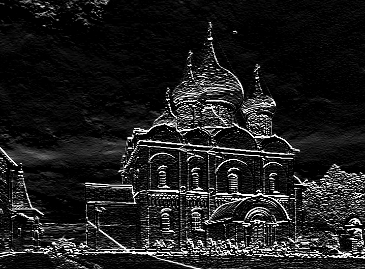
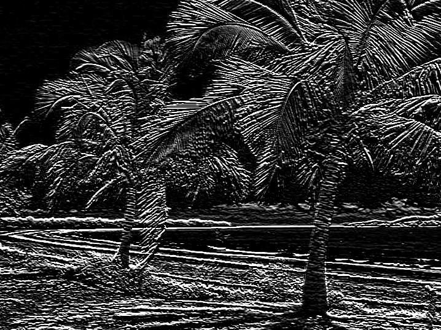

 ## See Web [deployment](http://edge-detect.herokuapp.com/)
 ## Import required modules

---

### [#1]


```python
import numpy as np
import matplotlib.pyplot as plt
import matplotlib.cm as cm
from PIL import Image
%matplotlib inline
```
# function for image preprocessing 

---

### [#2]


```python
def image_processor(path_to_image_file,width_quality=720):
    #width_quality is a paramater used to reshape the image for optimal performance
    #the higher the width_quality == higher number of pixels == longer the excution time for the  function conv
    i=Image.open(path_to_image_file)
    dim=i.size[0]/width_quality
    img = np.asarray(i.resize((width_quality,int(i.size[1]/dim)),Image.ANTIALIAS).convert("RGB"))
    print("intial dimension:",i.size)

    #convert image to one dimension by replacing each pixel in the image with the corresponding mean of RGB
    img_gray=np.mean(img,axis=2,dtype=np.uint)
    print("gray image dimension:",img_gray.shape)
    
    plt.figure(figsize=(150, 150))
    plt.imshow(i)
    plt.show()
    
    #return one dimension image
    return img_gray
```
# convolution for image

---

### [#3]


```python
def conv(image,im_filter):
    #compute dimesions of image
    height,width=image.shape
    im_filter=np.asarray(im_filter)
    #output image size init with zero
    out_image=np.zeros((height-len(im_filter) +1,width-len(im_filter)+1))
    x=len(im_filter)
    #calcuating the out_image
    for row in range(len(out_image)):
        for col in range(len(out_image[0])):
            out_image[row,col]=np.sum(image[row:row+x,col:col+x]*im_filter)
    #fix cumulative that exceed 255
    out_image[out_image>255]=255
    out_image[out_image<0]=0
    
    #plotting out_image
    plt.figure(figsize=(150,150))
    plt.imshow(out_image,cmap=cm.gray)
    plt.show()
```


---

### [#4]


```python
edge_detection=([[4,2,4]
                ,[-1,0,1]
                ,[-4,-2,-4]])

conv(image_processor("download.jpg"),edge_detection)
```
Output:

    []




 ## define a filter to any (m x n) dimension as edge_detection

---

### [#5]


```python
edge_detection=([[4,2,4]
                ,[-1,0,1]
                ,[-4,-2,-4]])
```


---

### [#6]


```python
conv(image_processor("download1.jpg"),edge_detection)
```
Output:

    []





```


---


